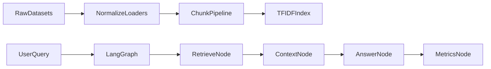

# LangGraph RAG Foundation

This project sets up a baseline Retrieval-Augmented Generation (RAG) system with a **LangGraph** execution flow and three training/evaluation datasets:

- [QuALITY](https://github.com/nyu-mll/quality)
- [Natural Questions](https://github.com/google-research-datasets/natural-questions)
- [HotpotQA](https://huggingface.co/datasets/hotpotqa/hotpot_qa)

Milestone 1 scope is **foundation only**:

- dataset ingestion/normalization
- chunking
- index build
- retrieval + answer flow in LangGraph
- basic evaluation report generation

This milestone does **not** include retriever or generator fine-tuning.

## Architecture



## Project Layout

```text
src/
  config.py
  datasets/
    schema.py
    quality_loader.py
    nq_loader.py
    hotpot_loader.py
  processing/chunker.py
  indexing/vector_store.py
  retrieval/retriever.py
  graph/rag_graph.py
  eval/metrics.py
  pipelines/
    build_index.py
    run_eval.py
tests/
  fixtures/
  test_loaders.py
  test_chunking.py
  test_graph_smoke.py
data/
  raw/
  processed/
  index/
```

## Setup

### 1) Create environment and install dependencies

```bash
python -m venv .venv
.venv\Scripts\activate
python -m pip install -r requirements.txt
```

### 2) Environment variables

Copy `.env.example` to `.env` and update if needed. Current defaults are enough for local baseline runs.

```bash
copy .env.example .env
```

## Dataset Preparation

Place dataset files in `data/raw/` (or pass absolute paths directly).

Expected file formats for this baseline:

- **QuALITY**: JSONL (article + questions list per line)
- **Natural Questions**: JSONL in original field style (`question_text`, `document_tokens`, `annotations`)
- **HotpotQA**: JSON array file (records with `context`, `supporting_facts`)

## Build the Index

Run on any combination of datasets:

```bash
python -m src.pipelines.build_index \
  --quality data/raw/quality_sample.jsonl \
  --nq data/raw/nq_sample.jsonl \
  --hotpot data/raw/hotpot_sample.json \
  --split train
```

You should see:

- index path
- record count
- chunk count

## Run Evaluation

Use a JSONL query file (`query`, optional `expected_answer`):

```bash
python -m src.pipelines.run_eval \
  --queries data/processed/sample_queries.jsonl \
  --output data/processed/eval_report.jsonl
```

Output rows include:

- `query`
- `expected_answer`
- `answer`
- `metrics` (`retrieved_count`, `answer_nonempty`, etc.)

## Test Commands

```bash
python -m pytest tests/test_loaders.py tests/test_chunking.py tests/test_graph_smoke.py
```

## Notes and Next Steps

### Current baseline decisions

- Retriever backend uses local TF-IDF vectors for low setup friction.
- Answer generation is deterministic and context-based (no paid LLM dependency required).

### Recommended Milestone 2

- Replace retrieval backend with dense embeddings + vector DB.
- Add reranking and query rewriting.
- Add LLM-based answer generation node.
- Introduce retriever training pipeline and benchmarking harness.

## Source References

- RAG tutorial overview and optimization path: [RAG 从零到一：构建你的第一个检索增强生成系统](https://www.cnblogs.com/informatics/p/19647478)
- QuALITY dataset repository: [nyu-mll/quality](https://github.com/nyu-mll/quality)
- Natural Questions dataset repository: [google-research-datasets/natural-questions](https://github.com/google-research-datasets/natural-questions)
- HotpotQA dataset card: [hotpotqa/hotpot_qa](https://huggingface.co/datasets/hotpotqa/hotpot_qa)
